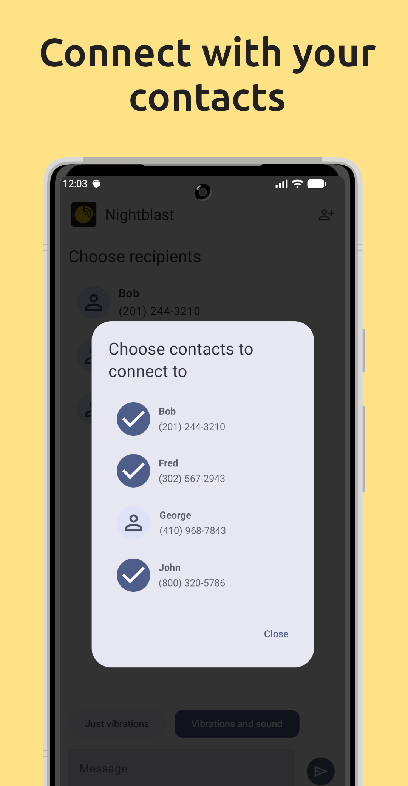
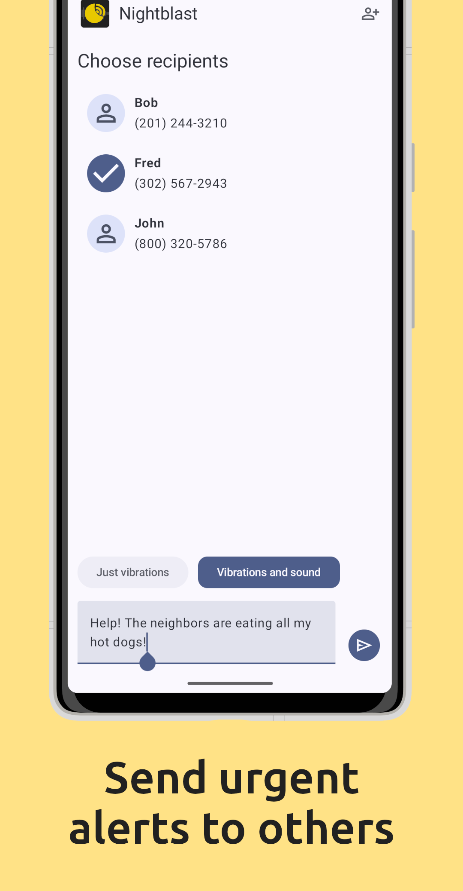
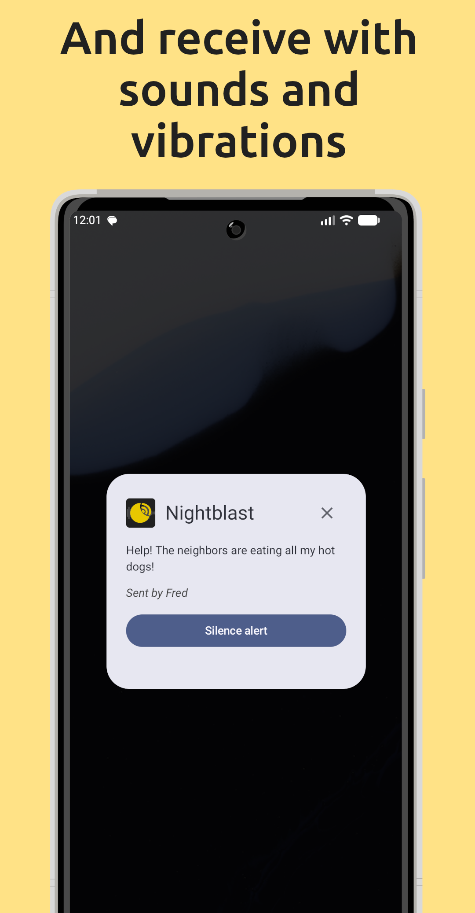
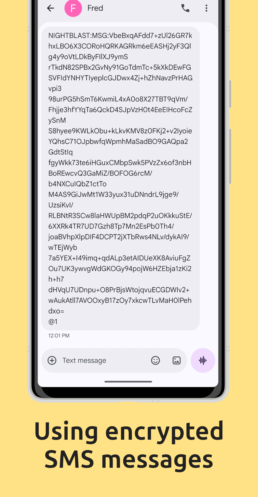

# Nightblast

Send urgent alerts to your contacts using encrypted SMS messages with Nightblast.

## Screenshots

## Description

With Nightblast, you can send urgent alerts to your contacts using encrypted SMS messages, with vibrations and optional sounds.

### How it works

When you connect with another Nightblast user, your phones exchange encryption keys. After you've exchanged keys, you can send encrypted alerts to each other.

Just select contacts in the **Recipients** section, choose **Just vibrations** or **Sounds and vibrations** and write your message. Then tap the send icon.

Nightblast encrypts your message and sends it to the selected recipients over SMS. When Nightblast receives the alert on the recipient's phone, it displays an alert dialog and vibrates the device.

If you selected **Sounds and vibrations**, Nightblast will play a loud sound using the **Alarms** audio channel, using whatever volume your phone is set to for alarms, and, if your phone is configured to let alarms break through do not disturb, you'll hear it even if do not disturb is enabled.

### Disclaimer

Nightblast uses SMS messages to communicate between devices. If your carrier charges for SMS messages, using Nightblast may incur additional charges or use your texting quota.

Connecting with another contact uses up to **12 SMS messages**, and sending an alert can use up to **6 SMS messages**.
